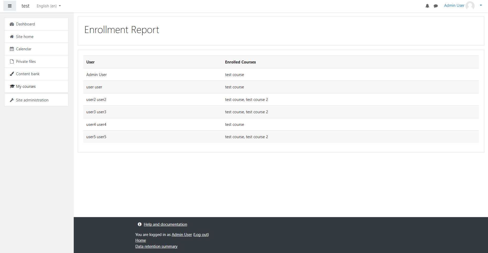

# Enrollment Report

This is a simple enrollment report page that displays a list of 10 random users and their enrolled courses.

## Made with

- PHP 7.4.9
- Moodle 3.10.11

## Installation

1. Create directory `local/users_report` in your Moodle installation.
2. Copy all files from this repository to the directory created in step 1.
3. Go to "{your-moodle-url}/local/users_report/index.php" to see the report.